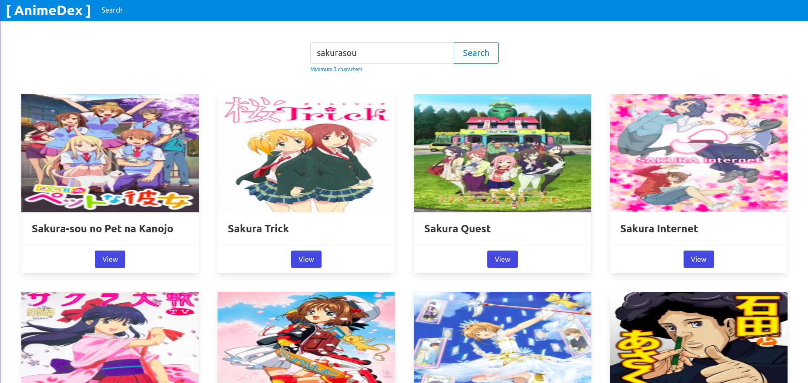
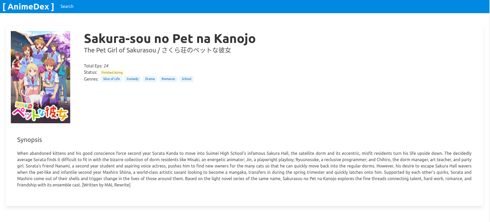
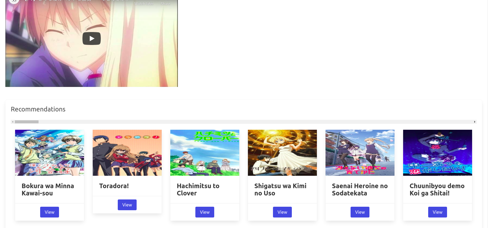
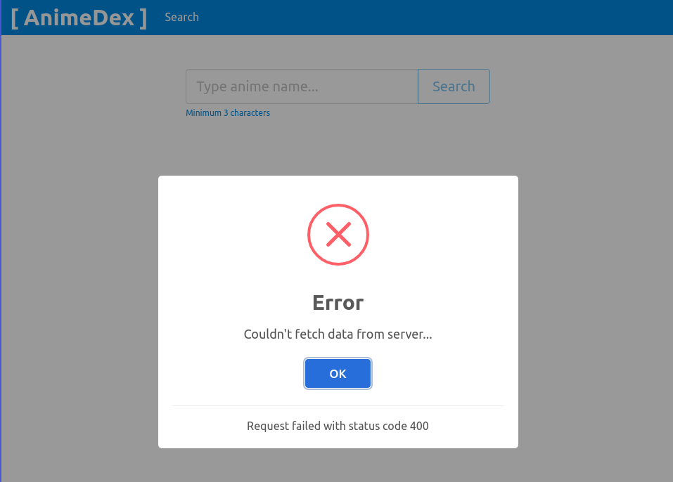
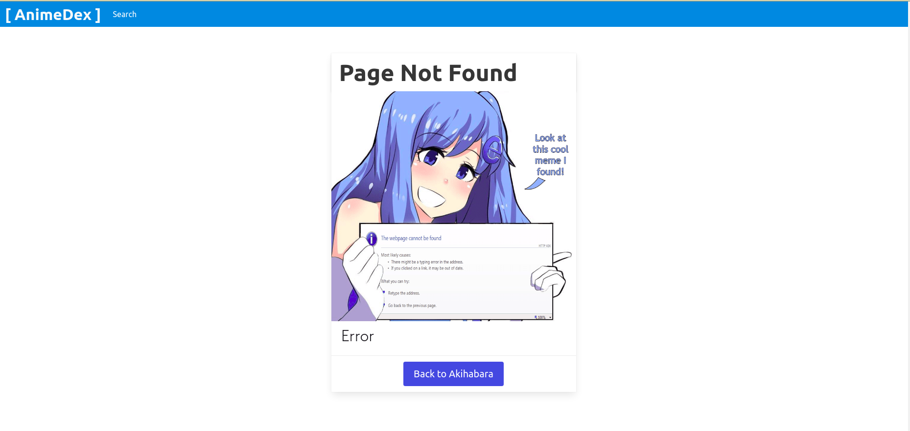

# AnimeDex

Consulte informações de qualquer anime utilizando dados de uma API pública!

Aplicação desenvolvida no meu tutorial **Crie seu primeiro projeto com ReactJS**.

<https://medium.com/@mrocha98/crie-seu-primeiro-projeto-com-reactjs-16e340dfde1a>

## 📚 Bibliotecas utilizadas

- [Create React App](https://reactjs.org/docs/create-a-new-react-app.html)
- [Node-Sass](https://www.npmjs.com/package/node-sass)
- [Bulma](https://bulma.io/documentation/)
- [SweetAlert2](https://sweetalert2.github.io/)
- [React Router Dom](https://www.npmjs.com/package/react-router-dom)
- [React Player](https://github.com/CookPete/react-player)

## 🔗 Links citados

- [Jikan public API](https://jikan.moe/)
- [JSX - React Docs](https://reactjs.org/docs/introducing-jsx.html)
- [Hooks - React Docs](https://reactjs.org/docs/hooks-intro.html)
- [Async Flow From Callback hell to Promite to Async Await - Medium](https://medium.com/@quyetvv/async-flow-from-callback-hell-to-promise-to-async-await-2da3ecfff997)
- [Async Await SIMPLES e DESCOMPLICADO - Código Fonte TV](https://youtu.be/h0sNAXE1ozo)
- [Composition vs Inheritance - React Docs](https://reactjs.org/docs/composition-vs-inheritance.html)
- [Lists and Keys - React Docs](https://reactjs.org/docs/lists-and-keys.html)

## ⚠️ Pré-requisitos

- [Node v12](https://nodejs.org/en/blog/release/v12.13.0/)
- [Yarn](https://yarnpkg.com/)

## 📺 Telas

## 🚀 Deploy

Durante o tutorial eu demonstro como utilizar a plataforma Vercel para fazer deploy da aplicação gratuitamente.

Acesse o projeto em produção: <https://anime-dex.vercel.app>

## 📜 Licença

MIT
